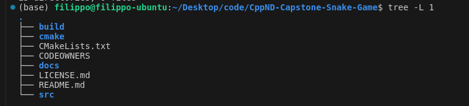

# CPPND: Capstone Snake Game Example

This is a starter repo for the Capstone project in the [Udacity C++ Nanodegree Program](https://www.udacity.com/course/c-plus-plus-nanodegree--nd213). The code for this repo was inspired by [this](https://codereview.stackexchange.com/questions/212296/snake-game-in-c-with-sdl) excellent StackOverflow post and set of responses.

The Capstone Project gives you a chance to integrate what you've learned throughout this program. This project will become an important part of your portfolio to share with current and future colleagues and employers.

In this project, you can build your own C++ application or extend this Snake game, following the principles you have learned throughout this Nanodegree Program. This project will demonstrate that you can independently create applications using a wide range of C++ features.
## Project Structure
This is a summary of the high level of the structure of the project:  

## Dependencies for Running Locally
* cmake >= 3.7
  * All OSes: [click here for installation instructions](https://cmake.org/install/)
* make >= 4.1 (Linux, Mac), 3.81 (Windows)
  * Linux: make is installed by default on most Linux distros
  * Mac: [install Xcode command line tools to get make](https://developer.apple.com/xcode/features/)
  * Windows: [Click here for installation instructions](http://gnuwin32.sourceforge.net/packages/make.htm)
* SDL2 >= 2.0
  * All installation instructions can be found [here](https://wiki.libsdl.org/Installation)
  >Note that for Linux, an `apt` or `apt-get` installation is preferred to building from source. 
* gcc/g++ >= 5.4
  * Linux: gcc / g++ is installed by default on most Linux distros
  * Mac: same deal as make - [install Xcode command line tools](https://developer.apple.com/xcode/features/)
  * Windows: recommend using [MinGW](http://www.mingw.org/)

## Basic Build Instructions

1. Clone this repo.
2. Make a build directory in the top level directory: `mkdir build && cd build`
3. Compile: `cmake .. && make`
4. Run it: `./SnakeGame`.

## New Features
- Set initial sped of the Snake
- Set Username
- Scores are saved in a file

## Addressed point in Rubric
- A README with instructions is included with the project

- The README indicates the new features you added to the game.

- The README includes information about each rubric point addressed.

- The submission must compile and run without errors on the Udacity project workspace.

- The project demonstrates an understanding of C++ functions and control structures: The project effectively utilizes various C++ functions and control structures, demonstrating a solid understanding and application of these fundamental programming concepts.

- The project reads data from a file and process the data, or the program writes data to a file: Scores are now saved into files (Score class). 

- The project accepts user input and processes the input: Username and initial speed of the snake are required as inputs from the user (main.cpp).

- The project uses data structures and immutable variables: these concepts are used across the project. For example in `score.h`, when declaring the method `int getScore() const;`, we are clearing saying that this method will not modify data.

- One or more classes are added to the project with appropriate access specifiers for class members: See `Score` class.

- Classes use appropriate access specifiers for class members: see for example getter and setter method in the `Score` class.

- Classes encapsulate behavior: See for example `SetInitialSpeed` method which is used in `game.UpdateStartSpeed()` (main.cpp);

- Classes abstract implementation details from their interfaces: see for example `score.h` (interface) and `score.cpp` (implementation).

- Class constructors utilize member initialization lists: see constructor of `Score` class.

- The project makes use of references in function declarations.

- The project uses destructors appropriately:    Destructor   `~Renderer()` is used in line 13 of  renderer.h.

- The project follows the Rule of 5 : See implementation `Score` class.

- The project uses smart pointers instead of raw pointers: `snake` is now handled by using shared pointer in the `Game` class.

## CC Attribution-ShareAlike 4.0 International

Shield: [![CC BY-SA 4.0][cc-by-sa-shield]][cc-by-sa]

This work is licensed under a
[Creative Commons Attribution-ShareAlike 4.0 International License][cc-by-sa].

[![CC BY-SA 4.0][cc-by-sa-image]][cc-by-sa]

[cc-by-sa]: http://creativecommons.org/licenses/by-sa/4.0/
[cc-by-sa-image]: https://licensebuttons.net/l/by-sa/4.0/88x31.png
[cc-by-sa-shield]: https://img.shields.io/badge/License-CC%20BY--SA%204.0-lightgrey.svg
